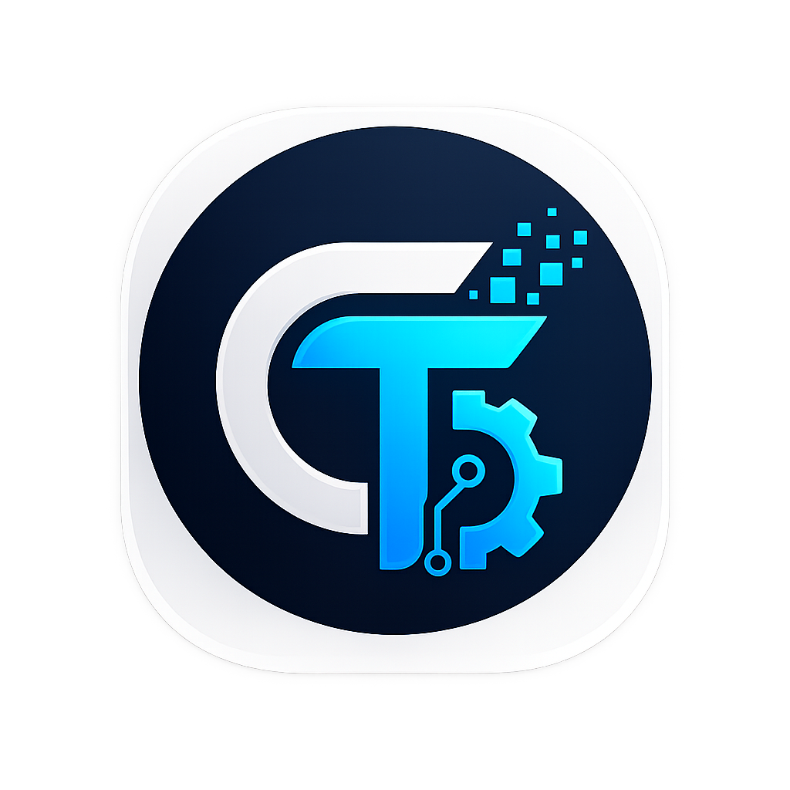

<div align="center">
    

    <h1>ChanThecno</h1>

    <p>
        <b>Tempat Imajinasi dan Informatika Bertemu</b>
    </p>

    <p>
        Platform teknologi yang sedang dikembangkan dari nol.
    </p>

    <p>
        <a href="https://chanthecno.vercel.app/">Website</a>
        ·
        <a href="https://github.com/candripanjaitan16/ChanThecno">Repository</a>
    </p>
</div>

---

## 👋 Halo, Saya Candri Panjaitan!

Saya adalah seorang siswa **SMA Kelas 12** yang memiliki ketertarikan besar terhadap dunia **Informatika dan teknologi**.

Saya sering memiliki banyak ide dan membayangkan bagaimana teknologi masa depan dapat dibuat. Daripada hanya menyimpannya di dalam pikiran, saya ingin mencoba mewujudkannya sedikit demi sedikit melalui kode.

Dari situlah **ChanThecno** dimulai.

ChanThecno bukanlah sebuah project yang langsung jadi. Project ini merupakan tempat saya:

- belajar pemrograman,
- mencoba teknologi baru,
- bereksperimen dengan berbagai ide,
- membangun sesuatu dari nol,
- dan mendokumentasikan perkembangan saya di dunia teknologi.

> **Sebuah ide tidak harus langsung sempurna. Yang penting, mulai dibuat.**

---

## 🚀 Apa itu ChanThecno?

**ChanThecno** adalah project teknologi yang saya bangun sebagai langkah awal menuju sebuah platform penyimpanan dan pengelolaan data berbasis cloud.

Konsep yang ingin saya bangun nantinya terinspirasi dari berbagai platform database dan cloud storage modern.

Untuk saat ini, ChanThecno masih berada dalam tahap pengembangan dan pembelajaran.

Fokus utama saya saat ini adalah membangun fondasi aplikasi terlebih dahulu, mulai dari:

- Landing page
- User interface
- Authentication
- Dashboard
- Database
- API
- Cloud storage
- Infrastructure

Semua bagian tersebut akan dikembangkan secara bertahap.

---

## 🧠 Filosofi

Saya ingin ChanThecno menjadi lebih dari sekadar sebuah website.

Project ini adalah **catatan perjalanan belajar saya**.

Setiap fitur yang ditambahkan, setiap bug yang ditemukan, dan setiap kesalahan yang terjadi merupakan bagian dari proses belajar.

Karena itu, project ini akan terus berubah seiring bertambahnya pengetahuan dan pengalaman saya.

---

## 🛠️ Teknologi

Teknologi yang saat ini digunakan:

| Teknologi | Penggunaan |
|---|---|
| **Next.js** | Framework utama aplikasi |
| **React** | Membangun interface |
| **TypeScript** | Bahasa pemrograman |
| **Tailwind CSS** | Styling dan layout |
| **Lucide React** | Icon interface |
| **React Icons** | Icon brand seperti GitHub |
| **Git** | Version control |
| **GitHub** | Repository dan dokumentasi |
| **Vercel** | Deployment |

---

## 📂 Struktur Project

Struktur project saat ini menggunakan Next.js App Router:

```text
ChanThecno/
├── app/
│   ├── globals.css
│   ├── layout.tsx
│   └── page.tsx
│
├── components/
│   ├── Header.tsx
│   └── Hero.tsx
│
├── public/
│   ├── assets/
│   │   └── icon.png
│   │
│   └── video/
│       └── bg.mp4
│
├── package.json
├── tsconfig.json
├── next.config.ts
└── README.md